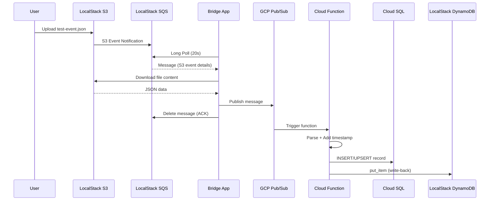

# 🌐 Hybrid Cloud Data Pipeline

> **A production-ready, event-driven data pipeline bridging LocalStack (simulated AWS) and Google Cloud Platform — provisioned entirely with Terraform Infrastructure as Code.**

[]()
[]()
[]()
[]()
[]()
[]()

---

## 📋 Table of Contents

- [Overview](#-overview)
- [Architecture](#-architecture)
- [Data Flow](#-data-flow)
- [Prerequisites](#-prerequisites)
- [Quick Start](#-quick-start)
- [Project Structure](#-project-structure)
- [Configuration Reference](#-configuration-reference)
- [Infrastructure as Code](#-infrastructure-as-code)
- [Components Deep Dive](#-components-deep-dive)
- [Testing the Pipeline](#-testing-the-pipeline)
- [Troubleshooting](#-troubleshooting)
- [Security Considerations](#-security-considerations)
- [License](#-license)

---

## 🎯 Overview

This project demonstrates a **hybrid multi-cloud architecture** — a pattern increasingly adopted by organizations to avoid vendor lock-in, optimize costs, and leverage best-of-breed services from different providers.

### What It Does

1. **Data Ingestion**: A JSON file is uploaded to an S3 bucket (simulated via LocalStack)
2. **Event Notification**: S3 triggers an SQS message notifying the system of the new file
3. **Cross-Cloud Bridge**: A Python bridge application polls SQS and forwards the data to GCP Pub/Sub
4. **Processing**: A GCP Cloud Function processes the data, adding timestamps
5. **Dual Storage**: Processed records are stored in both GCP Cloud SQL (PostgreSQL) and LocalStack DynamoDB

### Key Technologies

| Component | Technology | Purpose |
|-----------|-----------|---------|
| Local AWS Simulation | LocalStack | S3, SQS, DynamoDB without AWS costs |
| Infrastructure as Code | Terraform | Multi-cloud provisioning from a single codebase |
| Message Bridge | Python + Docker | Cross-cloud message forwarding |
| Event Processing | GCP Cloud Functions | Serverless data transformation |
| Message Bus (AWS) | SQS + DLQ | Reliable message queuing with dead-letter support |
| Message Bus (GCP) | Pub/Sub | Scalable event ingestion |
| Relational Storage | Cloud SQL (PostgreSQL) | ACID-compliant record storage |
| NoSQL Storage | DynamoDB (LocalStack) | High-performance key-value storage |

---

## 🏗️ Architecture

```
┌─────────────────── LocalStack (Docker) ───────────────────┐
│                                                            │
│  ┌──────────┐    S3 Event     ┌──────────────────┐        │
│  │  S3      │ ──────────────▶ │  SQS Queue       │        │
│  │  Bucket  │  Notification   │  (+ DLQ)         │        │
│  └──────────┘                 └────────┬─────────┘        │
│                                        │                   │
│  ┌──────────────────┐                  │                   │
│  │  DynamoDB        │ ◀───────────┐    │                   │
│  │  processed-      │             │    │                   │
│  │  records         │             │    │                   │
│  └──────────────────┘             │    │                   │
│                                   │    │                   │
└───────────────────────────────────│────│───────────────────┘
                                    │    │
                                    │    │ Poll & Download
                                    │    │
                              ┌─────│────▼─────────┐
                              │  Bridge App        │
                              │  (Docker Container)│
                              └─────────┬──────────┘
                                        │ Publish
                                        │
┌───────────────────── Google Cloud Platform ────────────────┐
│                                        │                   │
│  ┌──────────────────┐                  │                   │
│  │  Pub/Sub Topic   │ ◀───────────────┘                   │
│  │  localstack-     │                                      │
│  │  events          │                                      │
│  └────────┬─────────┘                                      │
│           │ Trigger                                        │
│           ▼                                                │
│  ┌──────────────────┐    Write     ┌──────────────────┐   │
│  │  Cloud Function  │ ──────────▶  │  Cloud SQL       │   │
│  │  (Processor)     │             │  (PostgreSQL)    │   │
│  └────────┬─────────┘             │  pipelinedb      │   │
│           │                        └──────────────────┘   │
│           │ Write-back to LocalStack DynamoDB              │
└───────────│───────────────────────────────────────────────┘
            │
            └──────────────▶ (crosses cloud boundary)
```

---

## 🔄 Data Flow



---

## ✅ Prerequisites

| Tool | Version | Purpose |
|------|---------|---------|
| [Docker](https://docs.docker.com/get-docker/) | 20.10+ | Container runtime |
| [Docker Compose](https://docs.docker.com/compose/) | 2.0+ | Service orchestration |
| [Terraform](https://www.terraform.io/downloads) | 1.3+ | Infrastructure as Code |
| [AWS CLI](https://aws.amazon.com/cli/) | 2.x | LocalStack interaction |
| [gcloud CLI](https://cloud.google.com/sdk/docs/install) | Latest | GCP interaction |
| [Python](https://www.python.org/) | 3.11+ | Local development (optional) |

### GCP Setup

1. Create a GCP project and enable billing
2. Enable required APIs:
   ```bash
   gcloud services enable \
       pubsub.googleapis.com \
       sqladmin.googleapis.com \
       cloudfunctions.googleapis.com \
       cloudbuild.googleapis.com \
       storage.googleapis.com
   ```
3. Create a service account with the required roles:
   ```bash
   gcloud iam service-accounts create pipeline-sa \
       --display-name="Pipeline Service Account"

   # Grant required roles
   for role in \
       roles/cloudfunctions.admin \
       roles/pubsub.editor \
       roles/cloudsql.client \
       roles/cloudsql.admin \
       roles/storage.admin; do
       gcloud projects add-iam-policy-binding YOUR_PROJECT_ID \
           --member="serviceAccount:pipeline-sa@YOUR_PROJECT_ID.iam.gserviceaccount.com" \
           --role="$role"
   done
   ```
4. Download the JSON key file:
   ```bash
   gcloud iam service-accounts keys create gcp-service-account-key.json \
       --iam-account=pipeline-sa@YOUR_PROJECT_ID.iam.gserviceaccount.com
   ```

### AWS CLI Configuration (for LocalStack)

```bash
# Configure a LocalStack profile
aws configure --profile localstack <<EOF
test
test
us-east-1
json
EOF

# Alias for convenience
alias awslocal='aws --endpoint-url=http://localhost:4566 --profile localstack'
```

---

## 🚀 Quick Start

### 1. Clone and Configure

```bash
git clone https://github.com/your-username/Hybrid-Cloud-Data-Pipeline-with-LocalStack-and-GCP.git
cd Hybrid-Cloud-Data-Pipeline-with-LocalStack-and-GCP

# Create environment file from template
cp .env.example .env

# Edit .env with your actual values
# - Set GCP_PROJECT_ID
# - Set PATH_TO_GCP_KEYFILE
# - Set CLOUD_SQL_PASSWORD
```

### 2. Start LocalStack & Bridge

```bash
# Start all services (LocalStack + Bridge)
docker-compose up --build -d

# Wait for LocalStack to become healthy
docker-compose ps  # Check STATUS column shows "healthy"

# Verify LocalStack resources were created
awslocal s3 ls
awslocal sqs list-queues
awslocal dynamodb list-tables
```

### 3. Deploy GCP Infrastructure with Terraform

```bash
cd terraform

# Create your variable file
cp terraform.tfvars.example terraform.tfvars
# Edit terraform.tfvars with your GCP project details

# Initialize and apply
terraform init
terraform validate
terraform plan
terraform apply
```

### 4. Test the Pipeline

```bash
# Upload test event to trigger the pipeline
awslocal s3 cp ../test-event.json s3://hybrid-cloud-bucket/

# Check SQS for the notification (should appear within seconds)
awslocal sqs receive-message \
    --queue-url http://localhost:4566/000000000000/data-processing-queue

# Wait ~30 seconds for the bridge to process and forward to GCP

# Verify DynamoDB write-back
awslocal dynamodb get-item \
    --table-name processed-records \
    --key '{"recordId":{"S":"xyz-789"}}'
```

---

## 📁 Project Structure

```
Hybrid-Cloud-Data-Pipeline-with-LocalStack-and-GCP/
│
├── docker-compose.yml          # Orchestrates LocalStack + Bridge
├── .env.example                # Environment variable template
├── .gitignore                  # Git ignore rules
├── submission.json             # Automated evaluation config
├── test-event.json             # Sample pipeline input data
├── README.md                   # This file
│
├── terraform/                  # Infrastructure as Code
│   ├── providers.tf            # AWS (LocalStack) + GCP providers
│   ├── variables.tf            # Variable definitions
│   ├── localstack.tf           # S3, SQS, DynamoDB resources
│   ├── gcp.tf                  # Pub/Sub, Cloud SQL, Cloud Function
│   ├── outputs.tf              # Output values
│   └── terraform.tfvars.example # Variable values template
│
├── src/
│   ├── bridge/                 # SQS → Pub/Sub bridge application
│   │   ├── bridge.py           # Main application code
│   │   ├── requirements.txt    # Python dependencies
│   │   └── Dockerfile          # Container image definition
│   │
│   └── processor_function/     # GCP Cloud Function
│       ├── main.py             # Function entry point
│       └── requirements.txt    # Python dependencies
│
├── localstack_init/            # LocalStack initialization
│   └── setup-s3-notifications.sh  # Auto-creates resources on startup
│
└── localstack_data/            # Persistent LocalStack data (gitignored)
```

---

## ⚙️ Configuration Reference

### Environment Variables

| Variable | Required | Default | Description |
|----------|----------|---------|-------------|
| `GCP_PROJECT_ID` | ✅ | — | Your GCP project ID |
| `GCP_REGION` | ❌ | `us-central1` | GCP region for resources |
| `PATH_TO_GCP_KEYFILE` | ✅ | — | Path to service account JSON key |
| `AWS_ACCESS_KEY_ID` | ❌ | `test` | AWS access key (LocalStack) |
| `AWS_SECRET_ACCESS_KEY` | ❌ | `test` | AWS secret key (LocalStack) |
| `AWS_DEFAULT_REGION` | ❌ | `us-east-1` | AWS region |
| `LOCALSTACK_ENDPOINT` | ❌ | `http://localhost:4566` | LocalStack gateway URL |
| `SQS_QUEUE_NAME` | ❌ | `data-processing-queue` | SQS queue name |
| `PUBSUB_TOPIC` | ❌ | `localstack-events` | GCP Pub/Sub topic name |
| `POLL_INTERVAL_SECONDS` | ❌ | `5` | Bridge poll interval |
| `SQS_WAIT_TIME_SECONDS` | ❌ | `20` | SQS long polling wait time |
| `CLOUD_SQL_PASSWORD` | ✅ | — | Cloud SQL user password |

### Input Data Contract

The pipeline expects JSON files uploaded to S3 with this structure:

```json
{
  "recordId": "string (unique identifier)",
  "userEmail": "string (valid email)",
  "value": 123
}
```

---

## 🏠 Infrastructure as Code

### Terraform Resources

#### LocalStack (via AWS Provider)

| Resource | Name | Description |
|----------|------|-------------|
| `aws_s3_bucket` | `hybrid-cloud-bucket` | Data ingestion bucket |
| `aws_sqs_queue` | `data-processing-queue` | Processing queue |
| `aws_sqs_queue` | `data-processing-queue-dlq` | Dead-letter queue |
| `aws_s3_bucket_notification` | — | S3→SQS event trigger |
| `aws_dynamodb_table` | `processed-records` | Write-back storage |

#### Google Cloud Platform

| Resource | Name | Description |
|----------|------|-------------|
| `google_pubsub_topic` | `localstack-events` | Bridge target topic |
| `google_pubsub_topic` | `localstack-events-dlq` | Dead-letter topic |
| `google_sql_database_instance` | `hybrid-pipeline-db` | PostgreSQL 14 instance |
| `google_sql_database` | `pipelinedb` | Application database |
| `google_cloudfunctions_function` | `pipeline-processor` | Event processor |

---

## 🔍 Components Deep Dive

### Bridge Application (`src/bridge/`)

The bridge is the critical link between AWS (LocalStack) and GCP. It runs as a Docker container alongside LocalStack.

**Key Features:**
- **Long Polling**: Uses SQS long polling (20s) to minimize API calls
- **Exponential Backoff**: Retries failed Pub/Sub publishes with exponential backoff (up to 5 retries)
- **Graceful Shutdown**: Handles SIGTERM/SIGINT for clean container stops
- **S3 Content Download**: Extracts the actual file content (not just the S3 event metadata) before forwarding
- **Structured Logging**: Timestamps, log levels, and contextual information

### GCP Cloud Function (`src/processor_function/`)

Serverless function triggered by Pub/Sub messages.

**Key Features:**
- **Idempotent Processing**: Uses `INSERT ... ON CONFLICT DO UPDATE` for Cloud SQL and `put_item` (overwrite) for DynamoDB
- **Dual Write**: Stores processed data in both Cloud SQL and DynamoDB
- **Auto-provisioning**: Creates the `records` table if it doesn't exist
- **Validation**: Checks for required fields before processing
- **Configurable Endpoints**: DynamoDB endpoint is configurable via environment variable

### LocalStack Init Script (`localstack_init/`)

Shell script that automatically creates AWS resources when LocalStack starts. This ensures resources exist immediately, even before Terraform is applied.

---

## 🧪 Testing the Pipeline

### End-to-End Test

```bash
# 1. Ensure everything is running
docker-compose up --build -d
docker-compose ps  # Verify healthy status

# 2. Upload test data
awslocal s3 cp test-event.json s3://hybrid-cloud-bucket/

# 3. Verify SQS received the notification
awslocal sqs receive-message \
    --queue-url http://localhost:4566/000000000000/data-processing-queue \
    --wait-time-seconds 10

# 4. Check bridge logs
docker logs bridge_app -f

# 5. Verify GCP processing (after ~60 seconds)
# Check Cloud SQL
gcloud sql connect hybrid-pipeline-db --user=pipeline_user --database=pipelinedb
# SQL> SELECT * FROM records WHERE id = 'xyz-789';

# 6. Verify DynamoDB write-back
awslocal dynamodb get-item \
    --table-name processed-records \
    --key '{"recordId":{"S":"xyz-789"}}'

# Expected output:
# {
#   "Item": {
#     "recordId": {"S": "xyz-789"},
#     "userEmail": {"S": "test@example.com"},
#     "value": {"N": "120"},
#     "processedAt": {"S": "2024-01-15T10:30:00+00:00"}
#   }
# }
```

### Verify Specific Components

```bash
# Check LocalStack health
curl http://localhost:4566/_localstack/health

# List S3 buckets
awslocal s3api list-buckets

# Describe SQS queue
awslocal sqs get-queue-attributes \
    --queue-url http://localhost:4566/000000000000/data-processing-queue \
    --attribute-names All

# Describe DynamoDB table
awslocal dynamodb describe-table --table-name processed-records

# Check GCP Cloud Function logs
gcloud functions logs read pipeline-processor --region=us-central1
```

---

## 🐛 Troubleshooting

### LocalStack Issues

| Issue | Solution |
|-------|----------|
| Container not starting | Ensure Docker is running and ports 4566, 4510-4559 are free |
| Health check failing | Wait 30-60 seconds for services to initialize |
| Resources missing | Check `docker logs localstack_main` for init script errors |
| S3 notification not working | Re-run `localstack_init/setup-s3-notifications.sh` manually |

### Bridge Application Issues

| Issue | Solution |
|-------|----------|
| Can't connect to SQS | Verify LocalStack is healthy and endpoint URL is correct |
| GCP auth errors | Check `GOOGLE_APPLICATION_CREDENTIALS` and key file mount |
| No messages received | Verify S3→SQS notification config with `awslocal s3api get-bucket-notification-configuration --bucket hybrid-cloud-bucket` |

### Terraform Issues

| Issue | Solution |
|-------|----------|
| `terraform init` fails | Check internet connectivity and provider versions |
| LocalStack resources fail | Ensure LocalStack is running before `terraform apply` |
| GCP resources fail | Verify credentials, project ID, and enabled APIs |

---

## 🔒 Security Considerations

1. **Credentials Management**: All secrets are loaded from environment variables (`.env` file), never hardcoded
2. **`.env` in `.gitignore`**: Prevents accidental credential commits
3. **Least Privilege**: GCP service account should have only required roles
4. **Non-root Container**: Bridge runs as a non-root user (`appuser`)
5. **Read-only Key Mount**: GCP key file is mounted read-only in the bridge container
6. **Network Isolation**: Docker services communicate via internal bridge network
7. **DLQ for Resilience**: Failed messages are captured in dead-letter queues for inspection

---

## 📊 Design Decisions

| Decision | Rationale |
|----------|-----------|
| **Python** over Node.js | Superior AWS/GCP SDK support, simpler async patterns for polling |
| **pg8000** over psycopg2 | Pure Python (no C dependencies), works in Cloud Functions without compilation |
| **LocalStack init script** | Belt-and-suspenders approach: resources exist even before Terraform |
| **Long polling** (20s) | Reduces API calls while maintaining low latency for new messages |
| **Idempotent writes** | ON CONFLICT upsert + DynamoDB put_item prevent duplicates |
| **DLQ on both sides** | Captures poison-pill messages without blocking the pipeline |

---

## 🧹 Cleanup

```bash
# Stop containers
docker-compose down -v

# Destroy GCP resources (to stop billing)
cd terraform
terraform destroy

# Remove local data
rm -rf localstack_data/
```

---

## 📄 License

This project is for educational purposes. See individual service terms for AWS, GCP, and LocalStack.