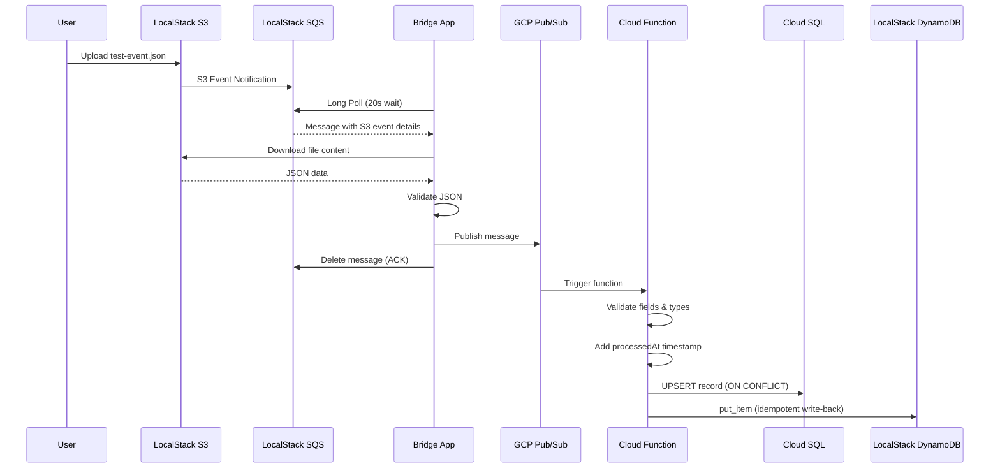

# 🌐 Hybrid Cloud Data Pipeline

> **A production-grade, event-driven data pipeline bridging LocalStack (simulated AWS) and Google Cloud Platform — provisioned entirely with Terraform Infrastructure as Code.**

[]()
[]()
[]()
[]()
[]()
[]()

---

## 📋 Table of Contents

- [Overview](#-overview)
- [Architecture](#-architecture)
- [Data Flow](#-data-flow)
- [Prerequisites](#-prerequisites)
- [Quick Start](#-quick-start)
- [Project Structure](#-project-structure)
- [Configuration Reference](#-configuration-reference)
- [Infrastructure as Code](#-infrastructure-as-code)
- [Components Deep Dive](#-components-deep-dive)
- [Testing the Pipeline](#-testing-the-pipeline)
- [Troubleshooting](#-troubleshooting)
- [Security Considerations](#-security-considerations)
- [Design Decisions](#-design-decisions)
- [Cleanup](#-cleanup)

---

## 🎯 Overview

This project demonstrates a **hybrid multi-cloud architecture** — a pattern increasingly adopted by organizations to avoid vendor lock-in, optimize costs, and leverage best-of-breed services from different providers.

### What It Does

1. **Data Ingestion** — A JSON file is uploaded to an S3 bucket (simulated via LocalStack)
2. **Event Notification** — S3 triggers an SQS message notifying the system of the new file
3. **Cross-Cloud Bridge** — A Python bridge application polls SQS and forwards the data to GCP Pub/Sub
4. **Processing** — A GCP Cloud Function processes the data, adding timestamps
5. **Dual Storage** — Processed records are stored in both GCP Cloud SQL (PostgreSQL) and LocalStack DynamoDB

### Key Technologies

| Component | Technology | Purpose |
|-----------|-----------|---------|
| Local AWS Simulation | LocalStack | S3, SQS, DynamoDB without AWS costs |
| Infrastructure as Code | Terraform (multi-provider) | Multi-cloud provisioning from a single codebase |
| Message Bridge | Python 3.11 + Docker | Cross-cloud message forwarding with retries |
| Event Processing | GCP Cloud Functions | Serverless data transformation |
| Message Bus (AWS) | SQS + Dead-Letter Queue | Reliable message queuing with poison-pill capture |
| Message Bus (GCP) | Pub/Sub + Dead-Letter Topic | Scalable event ingestion with retry policy |
| Relational Storage | Cloud SQL (PostgreSQL 14) | ACID-compliant record storage with upsert |
| NoSQL Storage | DynamoDB (LocalStack) | High-performance key-value write-back |

---

## 🏗️ Architecture

```
┌─────────────────── LocalStack (Docker) ───────────────────┐
│                                                            │
│  ┌──────────┐    S3 Event     ┌──────────────────┐        │
│  │  S3      │ ──────────────▶ │  SQS Queue       │        │
│  │  Bucket  │  Notification   │  (+ DLQ)         │        │
│  └──────────┘                 └────────┬─────────┘        │
│                                        │                   │
│  ┌──────────────────┐                  │                   │
│  │  DynamoDB        │ ◀───────────┐    │                   │
│  │  processed-      │             │    │                   │
│  │  records         │             │    │                   │
│  └──────────────────┘             │    │                   │
│                                   │    │                   │
└───────────────────────────────────│────│───────────────────┘
                                    │    │
                                    │    │ Poll & Download
                                    │    │
                              ┌─────│────▼─────────┐
                              │  Bridge App        │
                              │  (Docker Container)│
                              └─────────┬──────────┘
                                        │ Publish
                                        │
┌───────────────────── Google Cloud Platform ────────────────┐
│                                        │                   │
│  ┌──────────────────┐                  │                   │
│  │  Pub/Sub Topic   │ ◀───────────────┘                   │
│  │  localstack-     │                                      │
│  │  events (+DLQ)   │                                      │
│  └────────┬─────────┘                                      │
│           │ Trigger                                        │
│           ▼                                                │
│  ┌──────────────────┐    Upsert   ┌──────────────────┐    │
│  │  Cloud Function  │ ──────────▶ │  Cloud SQL       │    │
│  │  (Processor)     │             │  PostgreSQL 14   │    │
│  │  - Validates     │             │  pipelinedb      │    │
│  │  - Timestamps    │             │  └─ records      │    │
│  └────────┬─────────┘             └──────────────────┘    │
│           │                                                │
│           │ Write-back to LocalStack DynamoDB               │
└───────────│────────────────────────────────────────────────┘
            │
            └──────────────▶ (crosses cloud boundary)
```

---

## 🔄 Data Flow



---

## ✅ Prerequisites

| Tool | Version | Purpose |
|------|---------|---------|
| [Docker](https://docs.docker.com/get-docker/) | 20.10+ | Container runtime |
| [Docker Compose](https://docs.docker.com/compose/) | V2 (2.0+) | Service orchestration |
| [Terraform](https://www.terraform.io/downloads) | >= 1.3.0 | Infrastructure as Code |
| [AWS CLI v2](https://aws.amazon.com/cli/) | 2.x | LocalStack interaction via `awslocal` |
| [gcloud CLI](https://cloud.google.com/sdk/docs/install) | Latest | GCP interaction |
| [Python](https://www.python.org/) | 3.11+ | Local development (optional) |

### GCP Setup

1. **Create a GCP project** and enable billing

2. **Enable required APIs**:
   ```bash
   gcloud services enable \
       pubsub.googleapis.com \
       sqladmin.googleapis.com \
       cloudfunctions.googleapis.com \
       cloudbuild.googleapis.com \
       storage.googleapis.com
   ```

3. **Create a service account** with the required roles:
   ```bash
   gcloud iam service-accounts create pipeline-sa \
       --display-name="Pipeline Service Account"

   # Grant required roles (least privilege)
   for role in \
       roles/cloudfunctions.admin \
       roles/pubsub.editor \
       roles/cloudsql.client \
       roles/cloudsql.admin \
       roles/storage.admin \
       roles/iam.serviceAccountUser; do
       gcloud projects add-iam-policy-binding YOUR_PROJECT_ID \
           --member="serviceAccount:pipeline-sa@YOUR_PROJECT_ID.iam.gserviceaccount.com" \
           --role="$role"
   done
   ```

4. **Download the JSON key file**:
   ```bash
   gcloud iam service-accounts keys create gcp-service-account-key.json \
       --iam-account=pipeline-sa@YOUR_PROJECT_ID.iam.gserviceaccount.com
   ```

### AWS CLI Configuration (for LocalStack)

```bash
# Option 1: Install awslocal wrapper (recommended)
pip install awscli-local

# Option 2: Use an alias
alias awslocal='aws --endpoint-url=http://localhost:4566 --region us-east-1'
export AWS_ACCESS_KEY_ID=test
export AWS_SECRET_ACCESS_KEY=test
```

---

## 🚀 Quick Start

### 1. Clone and Configure

```bash
git clone https://github.com/your-username/Hybrid-Cloud-Data-Pipeline-with-LocalStack-and-GCP.git
cd Hybrid-Cloud-Data-Pipeline-with-LocalStack-and-GCP

# Create environment file from template
cp .env.example .env

# Edit .env with your actual values:
#   - GCP_PROJECT_ID (your GCP project ID)
#   - PATH_TO_GCP_KEYFILE (path to downloaded service account key)
#   - CLOUD_SQL_PASSWORD (a strong password)
```

### 2. Start LocalStack & Bridge

```bash
# Build and start all services
docker-compose up --build -d

# Wait for LocalStack to become healthy (~30-60 seconds)
docker-compose ps
# Look for: localstack_main  ...  Up (healthy)

# Verify LocalStack resources were created by the init script
awslocal s3 ls                    # Should show: hybrid-cloud-bucket
awslocal sqs list-queues          # Should show: data-processing-queue
awslocal dynamodb list-tables     # Should show: processed-records
```

### 3. Deploy GCP Infrastructure with Terraform

```bash
cd terraform

# Create your variable file
cp terraform.tfvars.example terraform.tfvars
# Edit terraform.tfvars with your GCP project details

# Initialize, validate, and apply
terraform init
terraform validate
terraform plan -out=tfplan
terraform apply tfplan

# Note: Cloud SQL provisioning takes 5-10 minutes
```

### 4. Test the Pipeline

```bash
# Upload test event to trigger the full pipeline
awslocal s3 cp test-event.json s3://hybrid-cloud-bucket/

# Watch bridge logs (should show message received and forwarded)
docker logs bridge_app -f

# Wait ~60 seconds for end-to-end processing, then verify:

# Check DynamoDB write-back
awslocal dynamodb get-item \
    --table-name processed-records \
    --key '{"recordId":{"S":"xyz-789"}}'

# Check Cloud SQL
gcloud sql connect hybrid-pipeline-db --user=pipeline_user --database=pipelinedb
# SQL> SELECT * FROM records WHERE id = 'xyz-789';
```

---

## 📁 Project Structure

```
Hybrid-Cloud-Data-Pipeline-with-LocalStack-and-GCP/
│
├── docker-compose.yml            # Orchestrates LocalStack + Bridge
├── .env.example                  # Environment variable template
├── .gitignore                    # Git ignore rules
├── submission.json               # Automated evaluation config
├── test-event.json               # Sample pipeline input data
├── README.md                     # This file
│
├── terraform/                    # Infrastructure as Code
│   ├── providers.tf              # AWS (→ LocalStack) + GCP + Archive providers
│   ├── variables.tf              # Variable definitions with defaults
│   ├── localstack.tf             # S3, SQS (+DLQ), DynamoDB, S3→SQS notification
│   ├── gcp.tf                    # Pub/Sub (+DLQ), Cloud SQL, Cloud Function, APIs
│   ├── outputs.tf                # Output values for resource references
│   └── terraform.tfvars.example  # Variable values template
│
├── src/
│   ├── bridge/                   # SQS → Pub/Sub bridge application
│   │   ├── bridge.py             # Main polling loop with health metrics
│   │   ├── requirements.txt      # Python dependencies
│   │   ├── Dockerfile            # Production container image
│   │   └── .dockerignore         # Build context exclusions
│   │
│   └── processor_function/       # GCP Cloud Function
│       ├── main.py               # Pub/Sub handler with connection pooling
│       └── requirements.txt      # Python dependencies
│
├── localstack_init/              # LocalStack initialization
│   └── setup-s3-notifications.sh # Auto-creates resources on container start
│
└── localstack_data/              # Persistent LocalStack data (gitignored)
```

---

## ⚙️ Configuration Reference

### Environment Variables

| Variable | Required | Default | Description |
|----------|----------|---------|-------------|
| `GCP_PROJECT_ID` | ✅ | — | Google Cloud project ID |
| `GCP_REGION` | ❌ | `us-central1` | GCP region for resource deployment |
| `PATH_TO_GCP_KEYFILE` | ✅ | — | Path to service account JSON key |
| `AWS_ACCESS_KEY_ID` | ❌ | `test` | AWS access key (LocalStack static) |
| `AWS_SECRET_ACCESS_KEY` | ❌ | `test` | AWS secret key (LocalStack static) |
| `AWS_DEFAULT_REGION` | ❌ | `us-east-1` | AWS region for LocalStack |
| `SQS_QUEUE_NAME` | ❌ | `data-processing-queue` | SQS queue name for S3 events |
| `PUBSUB_TOPIC` | ❌ | `localstack-events` | GCP Pub/Sub topic name |
| `POLL_INTERVAL_SECONDS` | ❌ | `5` | Delay between poll cycles (seconds) |
| `SQS_WAIT_TIME_SECONDS` | ❌ | `20` | SQS long poll wait (max: 20) |
| `CLOUD_SQL_PASSWORD` | ✅ | — | Password for Cloud SQL `pipeline_user` |
| `CLOUD_SQL_DATABASE` | ❌ | `pipelinedb` | Cloud SQL database name |
| `DYNAMODB_TABLE_NAME` | ❌ | `processed-records` | DynamoDB table for write-back |

> **Note**: `LOCALSTACK_ENDPOINT` is set automatically to `http://localstack:4566` inside Docker Compose. Use `http://localhost:4566` only when interacting from the host machine.

### Input Data Contract

The pipeline expects JSON files uploaded to S3 matching this schema:

```json
{
  "recordId": "string — unique identifier, used as primary key",
  "userEmail": "string — valid email address",
  "value": 123
}
```

All three fields are required. `value` must be numeric (integer).

---

## 🏠 Infrastructure as Code

### Terraform Providers

| Provider | Source | Purpose |
|----------|--------|---------|
| `aws` ~> 4.0 | hashicorp/aws | S3, SQS, DynamoDB via LocalStack |
| `google` ~> 4.0 | hashicorp/google | Pub/Sub, Cloud SQL, Cloud Functions |
| `archive` ~> 2.0 | hashicorp/archive | Zip Cloud Function source code |
| `random` ~> 3.0 | hashicorp/random | Globally unique GCS bucket names |

### LocalStack Resources (via AWS Provider)

| Resource | Name | Key Configuration |
|----------|------|-------------------|
| `aws_s3_bucket` | `hybrid-cloud-bucket` | `force_destroy = true` |
| `aws_sqs_queue` | `data-processing-queue` | Long poll 20s, visibility 60s, redrive to DLQ |
| `aws_sqs_queue` | `data-processing-queue-dlq` | 14-day retention for failed messages |
| `aws_s3_bucket_notification` | — | Filters `*.json`, sends to SQS |
| `aws_sqs_queue_policy` | — | Allows S3 to send messages |
| `aws_dynamodb_table` | `processed-records` | Hash key: `recordId` (String) |

### GCP Resources

| Resource | Name | Key Configuration |
|----------|------|-------------------|
| `google_pubsub_topic` | `localstack-events` | 24h message retention |
| `google_pubsub_topic` | `localstack-events-dlq` | Dead-letter for failed messages |
| `google_pubsub_subscription` | `localstack-events-subscription` | 5 max delivery attempts, retry backoff 10s→600s |
| `google_sql_database_instance` | `hybrid-pipeline-db` | PostgreSQL 14, f1-micro, backup enabled |
| `google_sql_database` | `pipelinedb` | Application database |
| `google_sql_user` | `pipeline_user` | Password from `cloud_sql_password` variable |
| `google_cloudfunctions_function` | `pipeline-processor` | Python 3.11, 256MB, 120s timeout, max 10 instances |
| `google_storage_bucket` | `{project}-fn-src-{hash}` | Versioned, globally unique name |

---

## 🔍 Components Deep Dive

### Bridge Application (`src/bridge/`)

The bridge is the critical link between AWS (LocalStack) and GCP. It runs as a Docker container alongside LocalStack.

**Production Features:**
| Feature | Implementation |
|---------|----------------|
| Long Polling | SQS `WaitTimeSeconds=20` reduces API calls to ~3/minute when idle |
| Exponential Backoff | 1s → 2s → 4s → 8s → 16s retries for Pub/Sub failures (5 max) |
| Graceful Shutdown | Handles `SIGTERM`/`SIGINT`, completes in-flight message before exit |
| Content Download | Downloads actual S3 file (not just event metadata) before forwarding |
| JSON Validation | Validates S3 content is valid JSON before publishing to Pub/Sub |
| URL Decoding | Properly handles URL-encoded S3 keys (`%20`, `+`, etc.) |
| Health Metrics | Logs `received/forwarded/failed/errors` counts every 60 seconds |
| Security | Runs as non-root `appuser` in Docker, GCP key mounted read-only |

### GCP Cloud Function (`src/processor_function/`)

Serverless function triggered by Pub/Sub messages.

**Production Features:**
| Feature | Implementation |
|---------|----------------|
| Idempotent SQL | `INSERT ... ON CONFLICT (id) DO UPDATE` — safe for duplicate triggers |
| Idempotent DynamoDB | `put_item` overwrites existing items by primary key |
| Connection Pooling | Module-level cached connections survive across warm invocations |
| Stale Detection | Tests cached SQL connection with `SELECT 1` before use |
| Field Validation | Checks required fields exist AND validates types (string, numeric) |
| Named Parameters | Uses `pg8000.native` with `:name` parameters for safety |
| Auto-DDL | Creates `records` table on first invocation, skips on subsequent |
| Concurrency Limit | `max_instances = 10` prevents connection exhaustion |

### LocalStack Init Script (`localstack_init/`)

Shell script that auto-creates AWS resources when LocalStack reaches ready state:
- Idempotent: uses `|| echo "already exists"` pattern
- Creates S3 bucket → SQS DLQ → SQS queue (with redrive) → DynamoDB table → S3 notification
- Runs before Terraform, so the bridge can poll immediately

---

## 🧪 Testing the Pipeline

### End-to-End Test

```bash
# 1. Ensure everything is running
docker-compose up --build -d
docker-compose ps  # Wait for "healthy" status

# 2. Upload test data
awslocal s3 cp test-event.json s3://hybrid-cloud-bucket/

# 3. Verify SQS received the S3 event notification
awslocal sqs receive-message \
    --queue-url $(awslocal sqs get-queue-url --queue-name data-processing-queue --output text --query 'QueueUrl') \
    --wait-time-seconds 10

# 4. Watch bridge logs for forwarding confirmation
docker logs bridge_app --tail 50

# 5. Wait ~60 seconds, then verify DynamoDB write-back
awslocal dynamodb get-item \
    --table-name processed-records \
    --key '{"recordId":{"S":"xyz-789"}}'

# Expected DynamoDB output:
# {
#   "Item": {
#     "recordId": {"S": "xyz-789"},
#     "userEmail": {"S": "test@example.com"},
#     "value": {"N": "120"},
#     "processedAt": {"S": "2026-04-11T10:30:00+00:00"}
#   }
# }

# 6. Verify Cloud SQL (after GCP infrastructure is deployed)
gcloud sql connect hybrid-pipeline-db --user=pipeline_user --database=pipelinedb
# SQL> SELECT * FROM records WHERE id = 'xyz-789';
# Expected: id='xyz-789', user_email='test@example.com', value=120, processed_at=<timestamp>
```

### Component Verification

```bash
# LocalStack health
curl -sf http://localhost:4566/_localstack/health | python -m json.tool

# S3 bucket notification configuration
awslocal s3api get-bucket-notification-configuration --bucket hybrid-cloud-bucket

# SQS queue attributes (verify DLQ, visibility, polling)
awslocal sqs get-queue-attributes \
    --queue-url $(awslocal sqs get-queue-url --queue-name data-processing-queue --output text --query 'QueueUrl') \
    --attribute-names All

# DynamoDB table description
awslocal dynamodb describe-table --table-name processed-records

# GCP Cloud Function logs
gcloud functions logs read pipeline-processor --region=us-central1 --limit=20

# Bridge health metrics
docker logs bridge_app 2>&1 | grep "\[HEALTH\]"
```

---

## 🐛 Troubleshooting

### LocalStack Issues

| Symptom | Cause | Fix |
|---------|-------|-----|
| Container won't start | Port 4566 in use | `lsof -i :4566` and kill conflicting process |
| Health check stays "starting" | Services initializing | Wait 30-60s, check `docker logs localstack_main` |
| Resources missing after restart | Persistence not working | Verify `localstack_data/` volume mount exists |
| S3 notifications not firing | Notification config lost | `docker exec localstack_main bash /etc/localstack/init/ready.d/setup-s3-notifications.sh` |

### Bridge Application Issues

| Symptom | Cause | Fix |
|---------|-------|-----|
| Bridge exits immediately | `GCP_PROJECT_ID` not set | Set it in `.env` |
| "Connection refused" to SQS | LocalStack not healthy | Check `docker-compose ps` health status |
| GCP authentication errors | Key file not mounted | Verify `PATH_TO_GCP_KEYFILE` points to valid JSON |
| No messages forwarded | S3 notification not configured | Check `awslocal s3api get-bucket-notification-configuration --bucket hybrid-cloud-bucket` |

### Terraform Issues

| Symptom | Cause | Fix |
|---------|-------|-----|
| `terraform init` fails | Missing providers | Check internet connectivity |
| LocalStack resources timeout | LocalStack not running | Start LocalStack before `terraform apply` |
| Cloud SQL takes forever | Normal behavior | Cloud SQL provisioning takes 5-10 minutes |
| GCS bucket name conflict | Globally non-unique | The `random_id` suffix should prevent this |

---

## 🔒 Security Considerations

| Concern | Mitigation |
|---------|------------|
| **Credential Storage** | All secrets via `.env` file (gitignored). Never hardcoded in source. |
| **GCP Key File** | Mounted read-only (`:ro`) in Docker. Pattern-excluded in `.gitignore`. |
| **Non-root Container** | Bridge runs as `appuser` (UID 1000), not root. |
| **Docker Network** | Services communicate via internal `pipeline-network`, not host network. |
| **Cloud SQL Access** | `0.0.0.0/0` allowed for evaluation. **In production**: use VPC connector + private IP. |
| **Cloud SQL Password** | Passed as Terraform sensitive variable. In production: use Secret Manager. |
| **Dead-Letter Queues** | Both SQS and Pub/Sub capture failed messages — prevents silent data loss. |
| **Log Rotation** | Bridge container uses `json-file` driver with 10MB max, 3 file rotation. |

---

## 📊 Design Decisions

| Decision | Rationale |
|----------|-----------|
| **Python 3.11** | Best-in-class AWS/GCP SDK support, simpler than async Node.js for polling |
| **pg8000.native** | Pure Python (no C dependencies), reliable in Cloud Functions, named params |
| **Module-level connection cache** | Avoids connection setup latency on warm Cloud Function invocations |
| **LocalStack init script + Terraform** | Belt-and-suspenders: resources exist immediately for bridge, Terraform provides declarative IaC |
| **SQS long polling (20s)** | Max wait reduces API calls to ~3/min idle while maintaining low latency |
| **Idempotent writes everywhere** | `ON CONFLICT` upsert + DynamoDB `put_item` overwrite — safe for at-least-once delivery |
| **DLQ on both sides** | SQS DLQ (3 retries) + Pub/Sub DLQ (5 attempts) — captures poison pills |
| **`random_id` for GCS bucket** | GCS names are globally unique — avoids collision across projects |
| **`s3_use_path_style = true`** | Required for LocalStack — virtual-hosted style fails against local endpoint |
| **Health metrics logging** | Bridge logs `received/forwarded/failed/errors` every 60s for observability |

---

## 🧹 Cleanup

```bash
# Stop and remove containers + volumes
docker-compose down -v

# Destroy ALL GCP resources (stops billing immediately)
cd terraform
terraform destroy -auto-approve

# Remove local persistent data
rm -rf localstack_data/ dist/
```

> ⚠️ **Important**: Run `terraform destroy` to avoid ongoing Cloud SQL charges (~$7-10/day for `db-f1-micro`).

